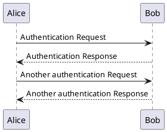

# gardener

 [](https://goreportcard.com/report/github.com/devops-kung-fu/gardener) [](https://codecov.io/gh/devops-kung-fu/gardener) [](gardener-sbom.json)

A utility that renders PlantUML diagram source in Markdown image tags. 

## Overview

[PlantUML](https://plantuml.com/) is a great application that allows users to create "Diagrams as Code". It has a simple syntax, is a fantastic way to render any diagram, and abstracts a lot of the tedious work needed to draw diagrams in an editor. 

At [DKFM](https://github.com/devops-kung-fu), when we develop PlantUML documents, we like to have a way for readers to view them in our Markdown without having to download code and generate diagrams themselves. ```gardener``` helps us do this. We can either run the executable manually, or use a pre-commit hook helper like [hooks](https://github.com/devops-kung-fu/hookz) to continuously generate diagrams before code is committed to a central repository.

## Installation

### Mac

You can use [Homebrew](https://brew.sh) to install ```gardener``` using the following:

``` bash
brew tap devops-kung-fu/homebrew-tap
brew install devops-kung-fu/homebrew-tap/gardener
```

If you do not have Homebrew, you can still [download the latest release](https://github.com/devops-kung-fu/hookz/releases) (ex: ```gardener_1.0.1_darwin_all.tar.gz```), extract the files from the archive, and use the ```gardener``` binary.  

If you wish, you can move the ```gardener``` binary to your ```/usr/local/bin``` directory or anywhere on your path.

### Linux

To install ```gardener```,  [download the latest release](https://github.com/devops-kung-fu/hookz/releases) for your platform and install locally. For example, install ```gardener``` on Ubuntu:

```bash
dpkg -i gardener_1.0.1_linux_arm64.deb
```

### Windows

To install ```gardener``` on Windows [download the latest release](https://github.com/devops-kung-fu/hookz/releases), extract, put somewhere on your PATH, and use.

## File Support

```gardener``` will process the following PlantUML and Markdown extensions:

### PlantUML

- .pu
- .puml
- .plantuml
- .iuml
- .wsd

### Markdown

- .md

## Modifying your Markdown for gardener support

Let's say you have our diagram source in `diagrams/src/alicenbob.pu` and we want to render it in README.md. All you need to do is add the following line where we'd want to display the UML in our Markdown. 

**NOTE:** Insert the path to the diagram source in the **alt** text (the part in brackets) of the image tag.

``` markdown


```
```gardener``` will handle the rest and take care of finding diagram source files, markdown files, and image source and then will update the links in your Markdown.


### Example



``` markdown
# My Markdown File

Below is the image tag that gardener will update


```

Gardener will change that link to:

```

```
Which will render like this:


## Usage

### CLI Usage

The easist way to use ```gardener``` without any integration with CI/CD or pre-commit hooks is to simply install and run the executable.

Example:

``` bash

gardener generate .

```

This example will scan the current directory and update any Markdown it finds where a PlantUML URL exists in the ***alt*** tag of an image with a link which will ultimately render an image after ```gardener``` processes the file.


#### Options

The default behavior of ```gardener``` is to deflate any generated image URLs to the smallest URL it can. If you don't want to deflate the URL you can use the ```deflate``` flag.

Example:

``` bash

gardener generate --deflate=false .

```

Should you want to suppress all output, you can use the ```verbose``` flag and set it to false as follows:

``` bash

gardener generate --verbose=false .

```

If you want to get really into what ```gardener``` is doing under the hood, you can add the ```--debug``` flag to your command and you'll get extended output.

### Usage with hookz

```gardner``` is best used with [hookz](https://github.com/devops-kung-fu/hookz) so that diagram links are generated every time you commit code to your remote repository. To enable this functionality, follow the instructions to install ```hookz``` and then configure your ```.hookz.yaml``` file to add the following action:

__NOTE:__ Ensure that for the ```url``` value you select the appropriate ```gardener``` release for your platform and architecture.

``` yaml
version: 2.4.0
hooks:
  - type: pre-commit
    actions:
      - name: "Generate Images for PlantUML"
        exec: gardener
        args: ["generate", "--deflate", "."]
```

## Examples

Here are some examples from processed from [diagrams/src/example1.pu](diagrams/src/example1.pu) and [diagrams/src/example2.pu](diagrams/src/example2.pu). View the source of this README.md page to see the URL's that ```gardener``` has created.

`diagrams/src/sequence.pu`

![diagrams/src/sequence.pu](http://www.plantuml.com/plantuml/png/1C3DRXJD3WRWVLs55TQpO8N8OaJ_PAGZHQZ526NzuZPphEvskLskGBZwx_dM4f7zsEakPnTZeLdn21pqyXU7xrBQfkO87FGBl3sYTbkdkjUWJoylB-CybRQfEG87_H-s_WdD5AECBgMqJSqHEAZ9sSLOXeZwPwfx3Pf5_BvzZ7kNqZOrH-2W9cSNOnauQumrLecfxZLe5l7xzZ7kNKhRr1o1WvgSNOpbLN_BgvgCDLQ9gUurwDVUfRHDpH4ugCdPnLXUzRUygia8tXvHkwrJtMlGf-7hFCstqZOrH-2W9cSNOraGgQmEox76AZ7LlGRD8dxVFiQzIscRcYDmK9EpYx4iY5HMX-K8tXvHkwrJtMlGNDU7nBXtAMrJSmGEQd9sCPO5aShgiBnLo-yuXFvtE3XBszGSWOEQd5sCPK6aiZeiRzNohl-4FdyfRLDp10vgSdOnbWMHokgml5NBgUurwDFmTPxcMscRcYDmK9EpYx4Cd3L6yFQ8scsTwbw3S7QKjgav0WSrERiOoy1PurOjfxhNe5d4xzl7k7SfRLDp10vgSdOnbe6pngrQtlMVqESlfMrgZi11JSuknZ9mrhXLo-yuX0Qu_2q5d3NePvCeZaXbTLZIqqsZ9KqxMdiYD5eGgQmEow4u8fNLOKbFT-5gAqqxMdiYD5eGgQmEox4u8fNLOKbFhsX9quxMdWYD5aGggyDoAkLdaw3BbHP4Agl3SdYckRxLs0euzHqfj21IMHsMGoaB8fNLOJdGvKeB8fNLOJa-qnI25FeXPvUM1PpwZXHQ4Aci3iknb0MHokgm7EbofGMHokgmd9vfhcyrjW9EVKSABOXKLeVbL1P4Agl3SgBBvKeB8fNLOJa-qrkDRQucPPMMKJzeGQIoEYodKXP4Agl3SgJBvKeB8fNLOJayqmyvkxIaAGGfQra5dFgE55eGgQmEox6K1P7Awh0Sw7AvqiycyKnpDIchW5FVaK8B8fNLOJcKRs9hF_R_0000__y1003__m==)

`diagrams/src/class.pu`


`diagrams/src/ditta.pu`


## Software Bill of Materials

```gardener``` uses the CycloneDX to generate a Software Bill of Materials in CycloneDX format (v1.4) every time a developer commits code to this repository. More information for CycloneDX is available [here](https://cyclonedx.org)

The SBoM for the last commit of ```gardener``` is available [here](sbom/gardener.cyclonedx.json).


## Credits

A big thank-you to our friends at [Freepik](https://www.freepik.com) for the Gardener logo.
